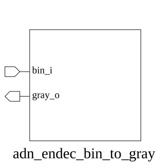

# adn_endec_bin_to_gray (module)

### Author : 

## TOP IO

## Parameters
|Name|Type|Dimension|Default Value|Description|
|-|-|-|-|-|
|WIDTH|int||8|Width of the binary/Gray code|

## Ports
|Name|Direction|Type|Dimension|Description|
|-|-|-|-|-|
|bin_i|input|logic [WIDTH-1:0]||Binary input|
|gray_o|output|logic [WIDTH-1:0]||Gray code output|
## Description

