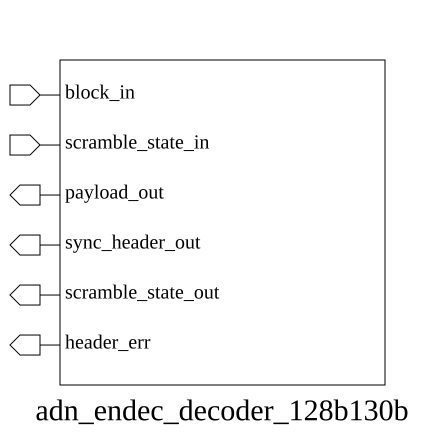

# adn_endec_decoder_128b130b (module)

### Author: Foez Ahmed (foez.official@gmail.com)

### Source: adn_endec_decoder_128b130b.sv

## Top IO

## Parameters

_None_

## Ports

|Name|Direction|Type|Dimension|Description|
|-|-|-|-|-|
|block_in|input|logic [129:0]|||
|scramble_state_in|input|logic [ 22:0]|||
|payload_out|output|logic [127:0]||Decoded 128-bit data payload|
|sync_header_out|output|logic [ 1:0]||Extracted 2-bit synchronization header|
|scramble_state_out|output|logic [ 22:0]||Updated 23-bit scrambler state for next cycle|
|header_err|output|logic|||

## Description

This module implements a 128b/130b decoder, which is responsible for reversing the 128b/130b encoding process. It extracts the 2-bit synchronization header and the 128-bit payload from the input 130-bit block, performs descrambling based on the provided state, and validates the synchronization header.

### Usage
The `adn_endec_decoder_128b130b` module is used in high-speed serial links to recover 128-bit data from 130-bit encoded blocks.
1. Connect the 130-bit received block to `block_in`.
2. Provide the current 23-bit scrambler state to `scramble_state_in`.
3. The module outputs the decoded 128-bit payload, the 2-bit sync header, and the updated scrambler state.
4. Monitor `header_err` to detect invalid synchronization headers, which indicates a potential framing error or link instability.

| REVISION | DATE       | AUTHOR          | DESCRIPTION                                            |
|----------|------------|-----------------|--------------------------------------------------------|
| 1.0      | 2026-07-29 | Foez Ahmed      | Stable release                                         |

Author : Foez Ahmed (foez.official@gmail.com)
