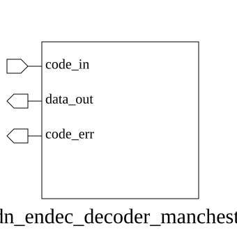

# adn_endec_decoder_manchester (module)

### Author: Foez Ahmed (foez.official@gmail.com)

### Source: adn_endec_decoder_manchester.sv

## Top IO



## Parameters

|Name|Type|Dimension|Default|Description|
|-|-|-|-|-|
|DATA_W|integer||8||
|INVERT_POLARITY|integer||0||


## Ports

|Name|Direction|Type|Dimension|Description|
|-|-|-|-|-|
|code_in|input|logic [(2*DATA_W)-1:0]|||
|data_out|output|logic [ DATA_W-1:0]|||
|code_err|output|logic|||


## Description

This module implements a Manchester decoder that converts a 2*N-bit encoded input stream into an N-bit data output. It validates the Manchester encoding rules (01 for logic 0, 10 for logic 1, or vice versa depending on polarity) and flags any invalid symbol transitions as errors.

### Usage

To use this module, instantiate it in your design by specifying the `DATA_W` parameter to match your desired output width. The `INVERT_POLARITY` parameter can be set to `1` if the Manchester encoding scheme is inverted (e.g., 10 for logic 0).

```systemverilog
adn_endec_decoder_manchester #(
.DATA_W(8),
.INVERT_POLARITY(0)
) u_decoder (
.code_in(encoded_data),
.data_out(decoded_data),
.code_err(error_flag)
);
```

| REVISION | DATE       | AUTHOR          | DESCRIPTION                                            |
|----------|------------|-----------------|--------------------------------------------------------|
| 1.0      | 2026-07-29 | Foez Ahmed      | Stable release                                         |

Author : Foez Ahmed (foez.official@gmail.com)
