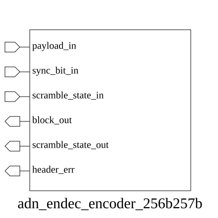

# adn_endec_encoder_256b257b (module)

### Author: Foez Ahmed (foez.official@gmail.com)

### Source: adn_endec_encoder_256b257b.sv

## Top IO

## Parameters

_None_

## Ports

|Name|Direction|Type|Dimension|Description|
|-|-|-|-|-|
|payload_in|input|logic [255:0]|||
|sync_bit_in|input|logic|||
|scramble_state_in|input|logic [ 22:0]|||
|block_out|output|logic [256:0]|||
|scramble_state_out|output|logic [ 22:0]|||
|header_err|output|logic|||

## Description

# Purpose
This module implements a 256b/257b encoder, which takes a 256-bit payload and a 1-bit synchronization header to produce a 257-bit encoded block. It incorporates payload scrambling based on an input state and validates the synchronization bit.

## Usage
To use this module, connect the 256-bit data payload to `payload_in` and the synchronization header to `sync_bit_in`. Provide the current 23-bit scrambling state via `scramble_state_in`. The module will output the encoded 257-bit block on `block_out` and the updated scrambling state on `scramble_state_out`. The `header_err` signal will assert high if the provided synchronization bit is invalid.

| REVISION | DATE       | AUTHOR          | DESCRIPTION                                            |
|----------|------------|-----------------|--------------------------------------------------------|
| 1.0      | 2026-07-29 | Foez Ahmed      | Stable release                                         |

Author : Foez Ahmed (foez.official@gmail.com)
