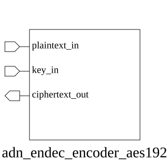

# adn_endec_encoder_aes192 (module)

### Author: Foez Ahmed (foez.official@gmail.com)

### Source: adn_endec_encoder_aes192.sv

## Top IO

## Parameters

_None_

## Ports

|Name|Direction|Type|Dimension|Description|
|-|-|-|-|-|
|plaintext_in|input|logic [127:0]|||
|key_in|input|logic [191:0]|||
|ciphertext_out|output|logic [127:0]|||

## Description

# Purpose
This module implements AES-192 encryption for one 128-bit input block using a 192-bit key.

## Usage
Drive `plaintext_in` and `key_in`; the encrypted 128-bit result is produced on `ciphertext_out`.

| REVISION | DATE       | AUTHOR          | DESCRIPTION                                            |
|----------|------------|-----------------|--------------------------------------------------------|
| 1.0      | 2026-08-21 | Foez Ahmed      | Stable release                                         |

Author : Foez Ahmed (foez.official@gmail.com)
