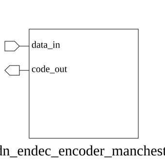

# adn_endec_encoder_manchester (module)

### Author: Foez Ahmed (foez.official@gmail.com)

### Source: adn_endec_encoder_manchester.sv

## Top IO

## Parameters

|Name|Type|Dimension|Default|Description|
|-|-|-|-|-|
|DATA_W|integer||8||
|INVERT_POLARITY|integer||0||

## Ports

|Name|Direction|Type|Dimension|Description|
|-|-|-|-|-|
|data_in|input|logic [DATA_W-1:0]||Parallel input data to be encoded|
|code_out|output|logic [(2*DATA_W)-1:0]||Serialized Manchester-encoded output|

## Description

### Purpose
This module implements a Manchester encoder that converts parallel input data into a serial Manchester-encoded bitstream. It maps each input bit to a two-bit code, where logic '0' and '1' are represented by specific transitions based on the configured polarity.

### Usage
To use this module, instantiate it in your design by specifying the `DATA_W` parameter to match your input data width. The `INVERT_POLARITY` parameter can be set to `1` to swap the transition logic if required by your physical layer protocol. The module performs combinatorial encoding, mapping each input bit to a 2-bit sequence at the output.

| REVISION | DATE       | AUTHOR          | DESCRIPTION                                            |
|----------|------------|-----------------|--------------------------------------------------------|
| 1.0      | 2026-07-29 | Foez Ahmed      | Stable release                                         |

Author : Foez Ahmed (foez.official@gmail.com)
