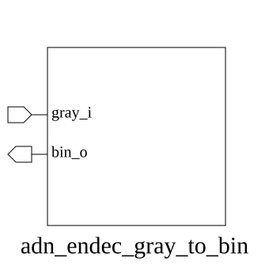

# adn_endec_gray_to_bin (module)

### Author : Foez Ahmed (foez.official@gmail.com)

## TOP IO

## Parameters
|Name|Type|Dimension|Default Value|Description|
|-|-|-|-|-|
|WIDTH|int||8||

## Ports
|Name|Direction|Type|Dimension|Description|
|-|-|-|-|-|
|gray_i|input|logic [WIDTH-1:0]|||
|bin_o|output|logic [WIDTH-1:0]|||
## Description

@foez---bhai, write the purpose of this module in markdown format here. This is already in multi-line comment, so don't add any additional comment syntax.

@foez---bhai, describe the usage of this module in markdown format here. This is already in multi-line comment, so don't add any additional comment syntax.

| REVISION | DATE       | AUTHOR          | DESCRIPTION                                            |
|----------|------------|-----------------|--------------------------------------------------------|
| 1.0      | 2026-07-29 | Foez Ahmed      | Stable release                                         |

This file is part of ADN-VLSI/adn_endec
 **Copyright (c) 2026 ADN Semiconductors**
 **Licensed under the MIT License**
 **See LICENSE file in the project root for full license information**

